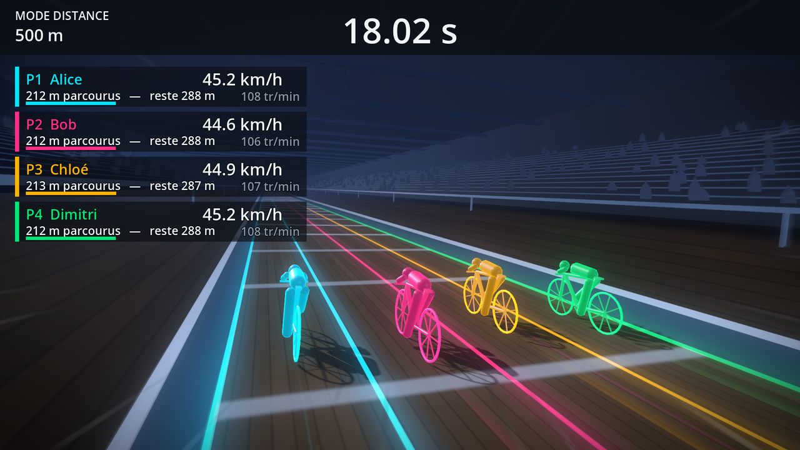
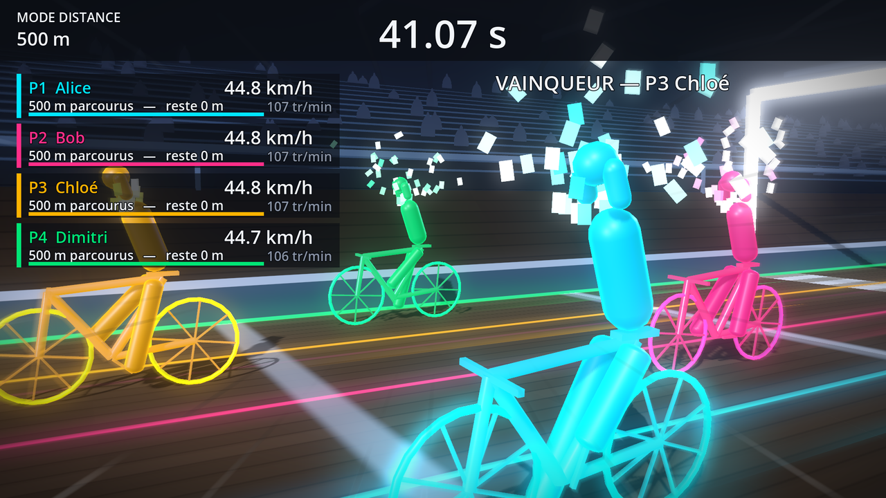
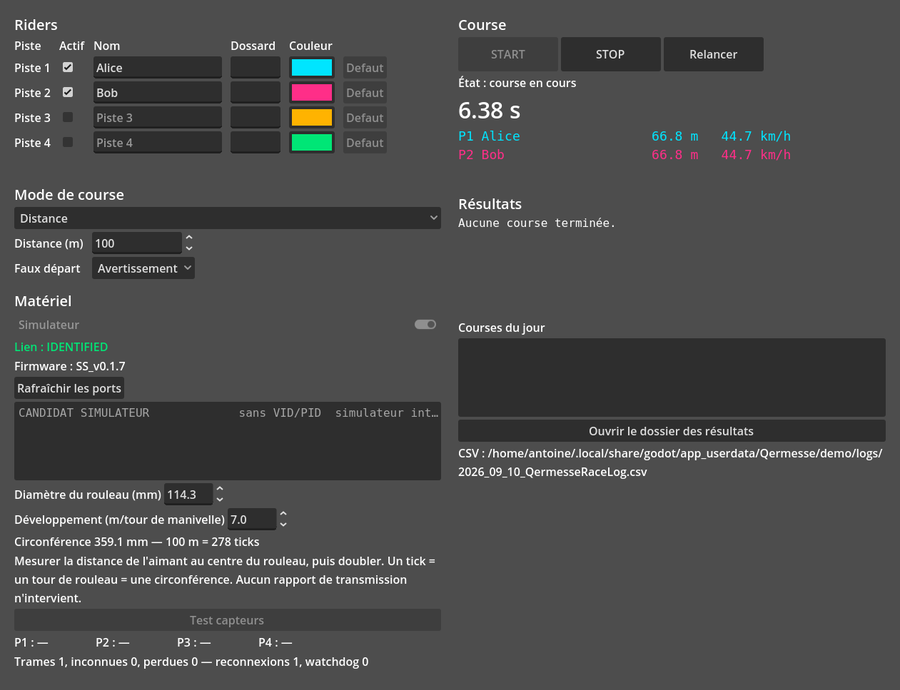

<p align="center">
  
</p>

<h1 align="center">Qermesse</h1>

<p align="center">
  <strong>Courses de rouleaux (goldsprints) pour les soirées, les bars et les kermesses.</strong><br>
  Un boîtier, jusqu'à quatre vélos, un vidéoprojecteur — et une salle qui crie.
</p>

<p align="center">
  <a href="https://github.com/pata27/Qermesse/actions/workflows/ci.yml"></a>
  <a href="https://github.com/pata27/Qermesse/releases"></a>
  
  
  
</p>

---

Deux vélos sur des rouleaux, un capteur par roue, un boîtier Arduino qui compte les tours.
**Qermesse** transforme ça en un écran de course en 3D pour le public et en un panneau
d'opérateur pour la personne qui tient la soirée. Il tourne sur un portable à GPU intégré,
sans réseau, et n'a rien à installer : une archive par système, on décompresse, on lance.

## Ce que ça fait

* **Trois modes** — course en **distance** (premier à 500 m), en **temps** (le plus loin en
  60 s), et **poursuite** : les écarts se creusent, le dernier est éliminé, jusqu'au dernier en
  course.
* **Jusqu'à quatre pistes**, chacune sa couleur de charte — les vélos de la salle.
* **Un écran public en 3D** : cartes de vitesse et de cadence, décompte, photo-finish, écran
  qui **se scinde** quand le peloton casse, podium avec confettis. 60 fps sur un GPU intégré,
  trois niveaux de qualité, dégradation automatique si la machine ne suit pas.
* **Un panneau opérateur** sur l'autre écran : riders, mode, matériel, résultats, journal de la
  soirée — et une ligne orange qui dit, dès le lancement, tout ce qui cloche.
* **Mode vitrine** : des coureurs synthétiques enchaînent des manches quand personne ne joue,
  et rendent la place sans rien laisser derrière eux.
* **Rien ne se perd** : un CSV par soirée, un JSON par course avec la trace complète des trames,
  rejouable à l'identique ; une course interrompue garde sa trace.
* **Faux départs**, lien perdu, capteur qui rebondit, disque plein : chaque incident a son
  message à l'écran et sa fiche dans [`docs/DEPANNAGE.md`](docs/DEPANNAGE.md).
* **Son** : décompte, cloche du dernier tour, hymne du podium — coupable d'un bouton.

<p align="center">
  
</p>

## Installer

Télécharger l'archive de son système sur la
[page des releases](https://github.com/pata27/Qermesse/releases), la décompresser, et tout lancer
**depuis le dossier obtenu** — le module série doit rester à côté de l'exécutable.

| Système | Archive | Note |
|---|---|---|
| Linux | `Qermesse-<version>-linux-x86_64.zip` | `chmod +x Qermesse.x86_64` si besoin |
| Windows | `Qermesse-<version>-windows-x86_64.zip` | l'`.exe` et sa `.dll` ensemble |
| macOS | `Qermesse-<version>-macos-universal.zip` | non signé : clic droit → **Ouvrir** la première fois, ou `xattr -dr com.apple.quarantine Qermesse.app` |

Puis, la veille de la soirée : brancher le boîtier, ouvrir Qermesse, lire la ligne orange du
panneau **Course**. Tout ce qu'elle dit se corrige avant que le public n'arrive. Le reste est dans
le [manuel opérateur](docs/MANUEL-OPERATEUR.md), et la [recette](docs/RECETTE.md) est la
liste à cocher avant chaque événement.

<p align="center">
  
</p>

## Matériel

Compatible avec les boîtiers **SilverSprint / OpenSprints** existants : un Arduino Uno (ou un
clone CH340, FTDI, CP210x) avec le firmware `ss_basic.ino` **non modifié** (`SS_v0.1.7`), un
capteur à effet Hall par rouleau, un aimant. Le protocole série, ses trames et ses pièges sont
décrits dans [`docs/01-PROTOCOLE-HARDWARE.md`](docs/01-PROTOCOLE-HARDWARE.md). Le diamètre du
rouleau se règle dans le panneau **Matériel** ; c'est la seule calibration.

Pas de boîtier sous la main ? Le **simulateur** intégré fait courir des riders synthétiques, et
l'émulateur `ss_emu` expose un vrai pseudo-terminal avec le firmware répliqué, pannes comprises.

## Pour développer

Godot 4.5, GDScript, un module série natif en C++ (GDExtension) et un émulateur C++.

```sh
git clone --recurse-submodules https://github.com/pata27/Qermesse.git && cd Qermesse

# Tests natifs C++ — parseur, file SPSC, machine à états du lien, émulateur.
cmake -S . -B build && cmake --build build -j && ctest --test-dir build --output-on-failure

# Module série natif.
cd addons/serial_link && scons target=template_debug -j8 && cd ../..

# Suite headless GDScript (380 tests) — code 0 si tout passe.
godot --headless --import && godot --headless --script tests/run.gd
```

Sans matériel :

```sh
# L'émulateur expose un vrai périphérique série…
./build/tools/ss_emu/ss_emu --pty --link ./.run/ttyEMU --riders 2 --profile domination
# …auquel l'outil console se connecte à travers le module natif.
godot --headless --script tools/ss_monitor.gd -- --port ./.run/ttyEMU --distance 100 --duree 20
# Ou, sans aucun port série, avec le simulateur GDScript :
godot --headless --script tools/ss_monitor.gd -- --sim --distance 100 --duree 20
```

Outils de preuve, tous headless et lancés par la CI : `ss_monitor` (lien série),
`ss_replay` (rejoue une course enregistrée et compare au classement — 0 divergence attendue),
`ss_operator_demo` (une course complète à l'interface), `ss_race3d_demo` (budget de rendu,
captures, vidéo), `ss_probe.py` (témoin indépendant du protocole, en Python).

> La compilation de `godot-cpp` passe des milliers de fichiers objets à l'archiveur ; au-delà
> d'une centaine de caractères de chemin, la ligne dépassait `ARG_MAX`. SCons écrit désormais ces
> arguments dans un fichier — le chemin du dépôt n'a plus d'importance.

### Les documents

| | |
|---|---|
| [`00-BRIEF`](docs/00-BRIEF.md) | pourquoi cette refonte, et ce qu'elle refuse de refaire |
| [`01-PROTOCOLE-HARDWARE`](docs/01-PROTOCOLE-HARDWARE.md) | le firmware, ses trames, ses pièges |
| [`02-MODES-DE-JEU`](docs/02-MODES-DE-JEU.md) | les règles, la machine à états, les fichiers |
| [`03-ARCHITECTURE`](docs/03-ARCHITECTURE.md) | les modules et leurs frontières |
| [`04-DIRECTION-ARTISTIQUE`](docs/04-DIRECTION-ARTISTIQUE.md) | l'écran public, figé avant le pixel |
| [`06-QUALITE-RISQUES`](docs/06-QUALITE-RISQUES.md) | règles de développement, tests, CI |
| [`07-EMULATEUR-FIRMWARE`](docs/07-EMULATEUR-FIRMWARE.md) | `ss_emu`, ses profils et ses pannes |
| [`MANUEL-OPERATEUR`](docs/MANUEL-OPERATEUR.md) | la soirée, du branchement au podium |
| [`DEPANNAGE`](docs/DEPANNAGE.md) | chaque message de l'écran, ce qu'il veut dire, quoi faire |
| [`RECETTE`](docs/RECETTE.md) | la liste à cocher avant un événement |

## Lignée

* **v1** — [cwhitney/SilverSprint](https://github.com/cwhitney/SilverSprint), C++/Cinder,
  macOS + Windows. Le firmware Arduino vient de là, et n'a pas bougé.
* **v2** — prototype C++/SDL2, abandonné.
* **Qermesse** — refonte complète sous Godot 4.5, trois OS, module série natif, s'est appelée
  *SilverSprint v3* jusqu'à la 0.9.1-beta.

Licence MIT.
