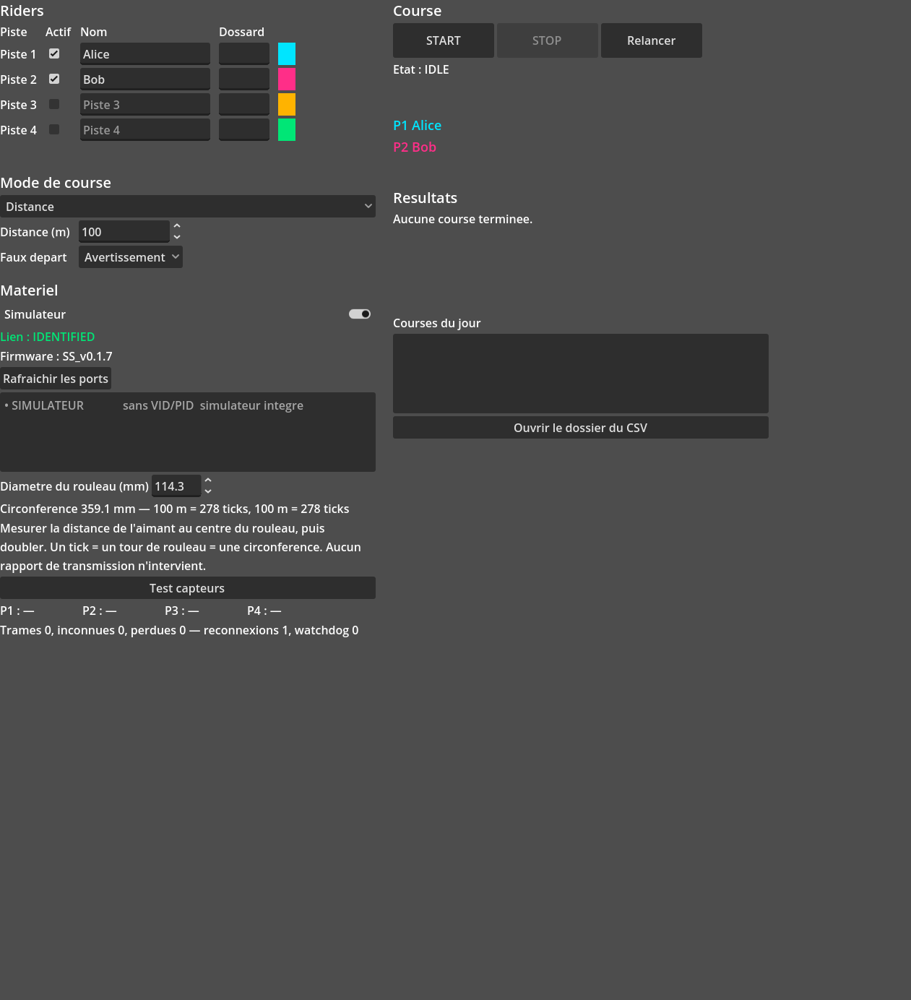
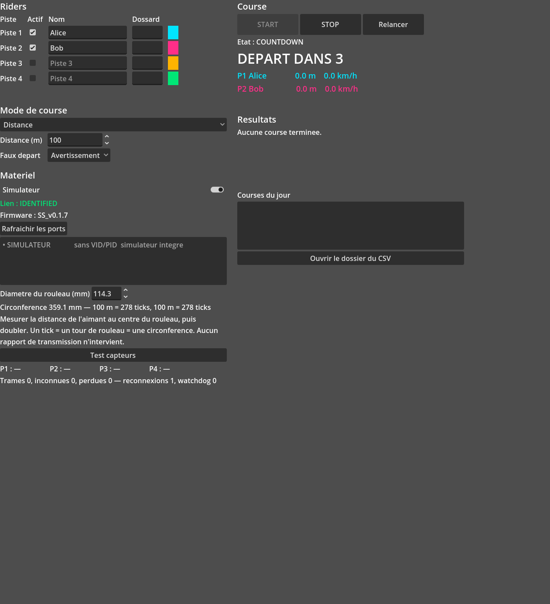
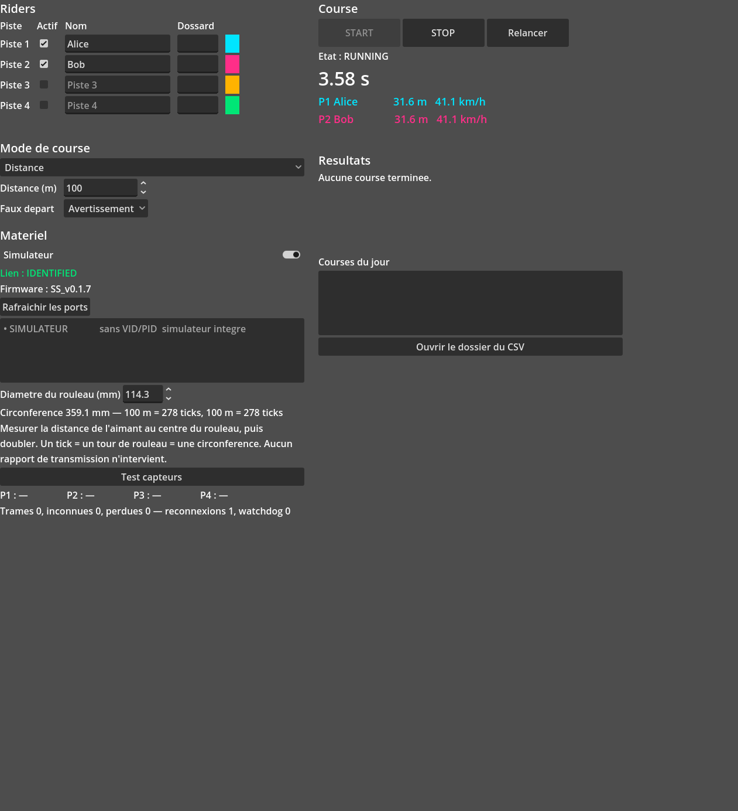
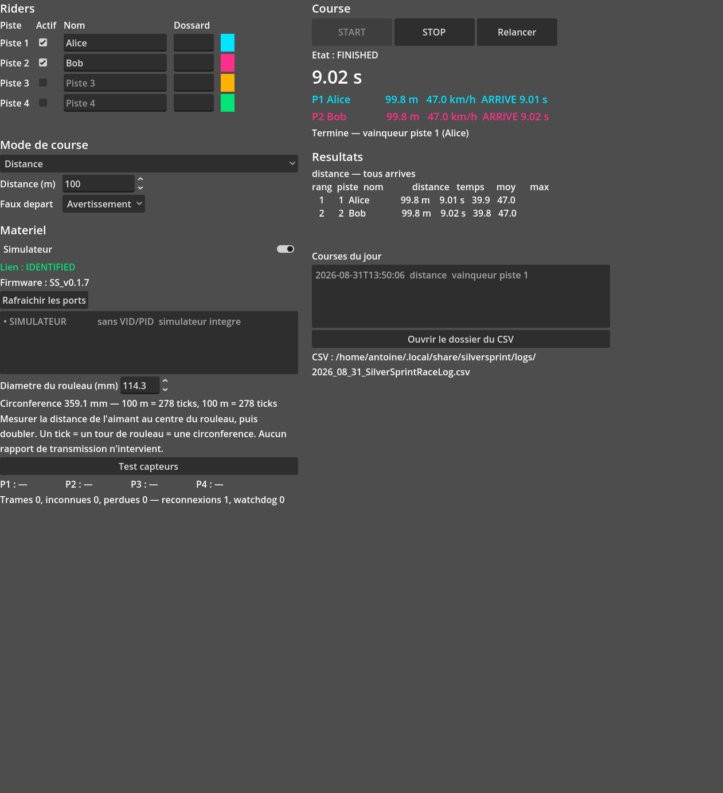

# Preuve — Jalon **J3** franchi

**Date** 2026-08-31 · **Exigence** `docs/05` lot 3

> *« Une course complète est menée de bout en bout au simulateur, sans toucher au clavier hors des
> boutons prévus, et le CSV produit est correct. »*

Deux preuves indépendantes : une exécution **dans la vraie fenêtre**, avec captures, et une suite de
tests headless qui rejoue le même scénario en CI sur les trois OS.

## 1. L'application réelle

```sh
godot --script tools/ss_operator_demo.gd -- --capture tasks/preuves/images --vitesse 3
```

L'outil n'appelle **aucune** méthode du contrôleur ni du moteur : il saisit dans les champs, choisit
dans les listes, et clique sur START. Si l'interface ne suffisait pas à mener une course, il
échouerait.

| | |
|---|---|
|  | **Configuration.** Deux pistes actives, noms saisis, mode distance à 100 m. Le panneau matériel annonce `IDENTIFIED`, firmware `SS_v0.1.7`, et traduit la calibration en direct : *« Circonference 359.1 mm — 100 m = 278 ticks »*. |
|  | **Décompte.** `DEPART DANS 3`, cadencé par les trames `CD:` du firmware, jamais par un minuteur local. START est grisé, STOP et Relancer sont actifs. |
|  | **Course.** Chrono issu de `elapsedMs` du firmware. Chaque piste porte **sa couleur et son numéro** — aucune information ne repose sur la seule couleur (`docs/03` §6). |
|  | **Résultats.** Classement, distances, temps, moyennes et pointes. La course entre dans l'historique du jour, et le chemin du CSV est affiché en clair. |

### Sortie

```
lien           : IDENTIFIED, firmware SS_v0.1.7
depart autorise : oui
en course      : 3.51 s
=== resultat ===
mode distance, fin : tous arrives
  rang 1  piste 1  Alice       99.8 m    9.01 s  moy  39.9 km/h  max  47.0 km/h
  rang 2  piste 2  Bob         99.8 m    9.02 s  moy  39.8 km/h  max  47.0 km/h
=== CSV : /home/antoine/.local/share/qermesse/logs/2026_08_31_QermesseRaceLog.csv ===
timestamp_iso,event,mode,rider,dossard,distance_m,temps_ms,vitesse_moy_kph,vitesse_max_kph,rang,note
2026-08-31T13:49:17,RACE_START,distance,,,,,,,,"uuid=20260831-134917-cb09, 2 piste(s) active(s)"
2026-08-31T13:49:21,RIDER_FINISH,distance,0,,,9009,,,1,
2026-08-31T13:49:21,RIDER_FINISH,distance,1,,,9020,,,2,
2026-08-31T13:49:21,RACE_FINISH,distance,0,,99.825,9009,39.890,47.007,1,tous arrives
2026-08-31T13:49:21,RACE_FINISH,distance,1,,99.825,9020,39.842,47.007,2,tous arrives
=== captures ===
  <dépôt>/tasks/preuves/images/j3-configure.png
  <dépôt>/tasks/preuves/images/j3-countdown.png
  <dépôt>/tasks/preuves/images/j3-course.png
  <dépôt>/tasks/preuves/images/j3-resultats.png
```

### Lecture du CSV

| Colonne | Vérification |
|---|---|
| en-tête | les onze colonnes de `docs/02` §5, dans l'ordre |
| `RACE_START` | écrit à l'armement, avec l'uuid et le nombre de pistes actives |
| `RIDER_FINISH` ×2 | **une ligne par franchissement**, pas une seule comme en v1 |
| `RACE_FINISH` ×2 | une ligne de résultat par rider classé, avec distance, temps, moyenne, pointe, rang |
| `9009` et `9020` ms | 100 m à ~45 km/h, écart de 11 ms entre les deux riders du profil `egaux` |
| `99.825` m | 278 ticks × 359,08 mm — cohérent au tick près |
| note `tous arrives` | le PC a conclu, et envoyé `s` |

L'append est **réel** : deux exécutions successives se sont ajoutées au même fichier du jour, sans
réécriture.

## 2. La suite headless, en CI

`tests/unit/test_operator_j3.gd` — 10 cas, qui n'agissent que sur les widgets :

* course complète menée aux boutons, CSV relu avec un vrai lecteur CSV et vérifié champ par champ ;
* le JSON de la course est **rejouable** et redonne le même classement ;
* START reste interdit tant que le lien n'est pas `IDENTIFIED`, et l'infobulle dit pourquoi ;
* START reste interdit sans piste active, ou en poursuite à un seul rider ;
* le panneau mode ne montre que les réglages du mode choisi ;
* la calibration donne un retour immédiat en ticks ;
* STOP interrompt la course et le CSV écrit `RACE_ABORTED`.

La CI exécute en plus `ss_operator_demo.gd` en headless sur ubuntu, windows et macos : les tests
unitaires vérifient les pièces, celui-ci vérifie que l'assemblage produit bien une course et un CSV.

## 3. Deux défauts trouvés en menant la course

1. **`vitesse_max` à 117 km/h pour un rider à 45.** La pointe était mesurée sur la vitesse
   *instantanée*, qui à 100 Hz est dominée par la quantification : un tick vaut 35,9 cm et une trame
   couvre 10 ms, donc un seul tick « vaut » 129 km/h. Elle se mesure désormais sur la vitesse lissée,
   fenêtre pleine — et sort à 47,0 km/h. `docs/01` §7 corrigé.
2. **L'interface bâtie contre un contrôleur vide.** Godot ne déclenche ni `_enter_tree` ni `_ready`
   de façon synchrone quand on ajoute un nœud depuis `SceneTree._initialize()`. Le panneau matériel
   affichait « aucun port détecté » sans rien signaler. Corrigé par une initialisation explicite et
   idempotente, et couvert par un test de non-régression.

## Ce que J3 ne prouve pas

Rien du matériel réel : tout ceci tourne au simulateur. **J1 reste ouvert.**
